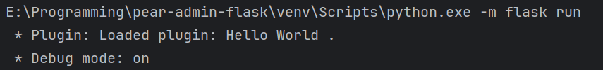

插件开发
=================

插件功能旨在最大限度不修改原框架的前提下添加新功能，并可以像程序原有框架一样进行流程注册，而且不需要修改任何程序框架原有代码（仅在配置文件中设置即可）。

所有插件放置在 `plugins` 文件夹中，项目提供了三个示例插件，分别是 `helloworld` 、 `realip` 和 `replacePage` ，分别用于示例页面的注册、修改 Flask 上下文和页面替换。

像项目自带的用户管理、部门管理等基本功能属于程序自身的“功能插件”，对于大多数衍生项目来说，多的是修改字符串和删除部分不需要的功能，
而插件开发主要可以用于添加自己的视图函数和功能，可以完美于项目融合，增加可拓展性。

插件的启用
-----------------

插件需要在 `applications/config.py` 中配置，你会找到如下的内容：

.. code-block:: python

    PLUGIN_ENABLE_FOLDERS = []

而在目录 `plugins` 中，你会发现存在 文件夹名称 为 `helloworld` 、 `realip` 和 `replacePage` 三个插件。比如我们想要启用 `helloworld` 插件，
仅需要做如下修改：

.. code-block:: python

    PLUGIN_ENABLE_FOLDERS = ["helloworld"]

假设有多个插件，只要依次在列表 `PLUGIN_ENABLE_FOLDERS` 中填入插件的文件夹名称即可。**注意：填写的先后顺序会影响插件加载的前后顺序，越前面的插件越早被加载。**

假设插件启用成功，你将会在控制台收到如下的提示：

.. code-block:: bash

    * Plugin: Loaded plugin: Hello World .

|

|

`helloworld` 插件启用之后，你可以访问 `http://127.0.0.1:5000/hello_world/` 来请求到新添加的页面。你会发现添加页面变的简单，仅需要修改一下设置项就行了。

|

|

插件的目录架构
-------------------

插件的目录架构如下：

.. code-block:: bash

    Plugin
    │  __init__.json
    └─ __init__.py

这是一个插件基本的目录架构，插件信息保存在 `__init__.json` 中，其本质是一个包含如下 JSON 字符串的文本文件：

.. code-block:: json

    {
      "plugin_name": "Hello World",
      "plugin_version": "1.0.0.1",
      "plugin_description": "一个测试的插件。"
    }

这个 JSON 文件中，记录了基本的插件名称与插件版本，以及插件的介绍。**在更新之后，此文件可以不存在，插件的名称默认为文件夹名。**

编写插件入口
-------------------

插件入口位于 `__init__.py` 中，请确保 `__init__.py` 文件一定包含 `event_init(app: Flask)` 函数，如下：

.. code-block:: python

    def event_init(app: Flask):
        pass

这个函数将会在插件加载时被调用，并传入项目的 `Flask` 对象，此后你可以像一般使用 Flask 一样添加视图函数。例如：

.. code-block:: python

    def event_init(app: Flask):
        @app.get('/test')
        def test():
            return "这是测试页面"

**当然，不推荐这样直接使用 Flask 对象创建视图函数，更妥当的做法是通过注册蓝图的方式来添加视图函数。您可以这样做：**

在您编写的插件目录下建立一个 `main.py` 文件，并在该文件中添加蓝图：

.. code-block:: python

    from flask import render_template, Blueprint

    # 创建蓝图
    helloworld_blueprint = Blueprint('hello_world', __name__,
                                     template_folder='templates',
                                     static_folder="static",
                                     url_prefix="/hello_world")

    @helloworld_blueprint.route("/")
    def index():
        return render_template("helloworld_index.html")

而后在 `__init__.py` 中注册该蓝图：

.. code-block:: python

    from flask import Flask
    from .main import helloworld_blueprint

    def event_init(app: Flask):
        """初始化完成时会调用这里"""
        app.register_blueprint(helloworld_blueprint)

这样可以使目录架构更加清晰。

.. important::

    注意不要直接在 `__init__.py` 的 `event_init` 函数外直接写存在阻塞的代码，不然项目 Flask 将不能初始化完成。

.. note::

    在编写插件的前端模板（template）时，请尽量将模板文件放在项目根目录的 `templates` 文件中，这样可以保持良好的项目架构。
    当然另一种做法是像 helloworld 插件那样，直接放在插件目录的 templates 中，但是一定要做好模板名称的区分，
    因为 flask 默认找模板行为是从根目录开始找的，如果根目录 templates 和插件目录的 templates 中存在的模板重名，
    则会优先使用根目录 templates 的模板文件。